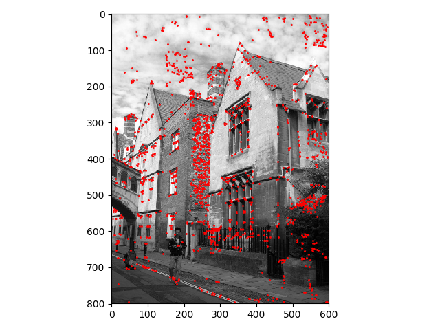

# Panorama Maker
This program converts mp4 videos into a panorama. 

    

* the original video can be found [here](https://github.com/IdoSagiv/panorama-maker/blob/main/videos/boat.mp4)
## Technologies And Tools
This program is written in Python and using the libraries: 'numpy', 'mayplotlib', 'scipy' and 'imageio'. 
The program was developed on Linux, and tested both over Linux and Windows machines.
## Overview
The panorama making process is:
1. Dividing the input video into frames
2. Finding feature points to every frame
3. Finding matching feature points to every two consecutive frames
4. Aligning the frames to a common coordinate system using the [RANSAC](https://en.wikipedia.org/wiki/Random_sample_consensus) algorithm
5. Stitching the aligned frames by their matching points

## Key Features
### Finding feature points
Features are found using the [Harris Corner Detector](https://en.wikipedia.org/wiki/Harris_Corner_Detector) algorithm, and a [MOPS-like](https://www.cs.cornell.edu/courses/cs6670/2011sp/projects/p1/webpages/6/webpage.html) descriptor is extracted from each feature point. 

    
    

### Finding matching points between two images
Using a comparison between the [MOPS-like](https://www.cs.cornell.edu/courses/cs6670/2011sp/projects/p1/webpages/6/webpage.html) descriptors of the feature points of each image. 
 
### Different perspectives
By taking strips from different locations in the frames and stitch them using the matching feature points, different perspectives of the scene can be made. 
 
 
